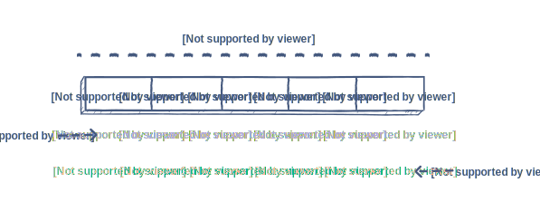

# Notes

# Approach problems

## Convert `Hash` to `Array`

Reference: dsa_challenges/tribex/mars_rover2.rb

Example:

    DIRECTIONS = {
      'North' => 0,
      'East' => 1,
      'South' => 2,
      'West' => 3
    }

OR

    DIRECTIONS = {
      0 => 'North',
      1 => 'East',
      2 => 'South',
      3 =>'West'
    }

=> It should be an Array, convert:

    DIRECTIONS = %w[North East South West]

## Iterate back and forth

Reference: dsa_challenges/tribex/mars_rover2.rb

Example:

    DIRECTIONS = %w[North East South West]

    current_direction = 0 # DIRECTIONS[current_direction] => 'North'

+ if `current_direction = 0` => 'North', then turn left: `(0 - 1) % 4 => 3` which is 'West'

      def turn_left(current_direction)
        current_direction = (current_direction - 1) % DIRECTIONS.length
      end

+ if `current_direction = 0` => 'North', then turn right: `(0 + 1) % 4 => 1` which is 'East'

      def turn_right
        current_direction = (current_direction + 1) % DIRECTIONS.length
      end

## Array Index

  

## Use `Hash` or `Set` to keep track items

  1. Super market checkout: count unique items for special prices

      - Reference: dsa_challenges/tribex/check_out.rb
      - Customer is buying items:

            items = ['A', 'B', 'A', 'C', 'A', 'D']

      - Iterate `items` and add them to a Hash:

            unique_items = Hash.new(0)

            items.each do |i|
              unique_items[i] += 1
            end

  2. Mark leaves fell to the pond that a frog can jump to:

      - Reference: dsa_challenges/colidity/frog_river_one.rb

            falling_leaf_positions = [1, 4, 3, 2, 1, 3, 5, 2, 4]

            covered_positions = Set.new # OR Hash.new

            falling_leaf_positions.each do |pos|
              covered_positions << pos
            end

          OR

            covered_positions = {}

            falling_leaf_positions.each do |pos|
              covered_positions[pos] = true if covered_positions[pos].nil?
            end

## Be careful of O(N**2)

  1. A time complexity of `O(N^2)` because of the nested loops in your solution

      - Reference: dsa_challenges/colidity/frog_river_one.rb

      - Example:

            falling_leaf_positions = [1, 4, 3, 2, 1, 3, 5, 2, 4]

            covered_positions = {}

            falling_leaf_positions.each do |pos|
              covered_positions[pos] = true if covered_positions[pos].nil?

              return idx if covered_positions.keys.size == x
            end

        *The `covered_positions.keys.size` operation is inside a loop that iterates through the entire array `falling_leaf_positions`, which makes the overall time complexity of the solution O(N^2) instead of O(N).*

        Solution: **DON'T get the `covered_positions.keys`, just get the hash's size `covered_positions.size`**

            return idx if covered_positions.size == x
