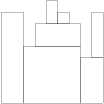

# Iterations

## BinaryGap

*Easy*

**Find longest sequence of zeros in binary representation of an integer.**

A binary gap within a positive integer `N` is any maximal sequence of consecutive zeros that is surrounded by ones at both ends in the binary representation of `N`.

For example, number `9` has binary representation `1001` and contains a binary gap of length 2. The number `529` has binary representation `1000010001` and contains two binary gaps: one of length 4 and one of length 3. The number `20` has binary representation `10100` and contains one binary gap of length 1. The number `15` has binary representation `1111` and has no binary gaps. The number `32` has binary representation `100000` and has no binary gaps.

Write a function:

    def solution(n)

that, given a positive integer `N`, returns the length of its longest binary gap. The function should return 0 if `N` doesn't contain a binary gap.

For example, given `N = 1041` the function should return 5, because `N` has binary representation `10000010001` and so its longest binary gap is of length 5. Given `N = 32` the function should return 0, because `N` has binary representation '`100000`' and thus no binary gaps.

Write an efficient algorithm for the following assumptions:

  - `N` is an integer within the range `[1..2,147,483,647]`.

# Arrays

## CyclicRotation

*Easy*

**Rotate an array to the right by a given number of steps.**

An array A consisting of N integers is given. Rotation of the array means that each element is shifted right by one index, and the last element of the array is moved to the first place. For example, the rotation of array A = [3, 8, 9, 7, 6] is [6, 3, 8, 9, 7] (elements are shifted right by one index and 6 is moved to the first place).

The goal is to rotate array A K times; that is, each element of A will be shifted to the right K times.

Write a function:

class Solution { public int[] solution(int[] A, int K); }

that, given an array A consisting of N integers and an integer K, returns the array A rotated K times.

For example, given

    A = [3, 8, 9, 7, 6]
    K = 3
the function should return [9, 7, 6, 3, 8]. Three rotations were made:

    [3, 8, 9, 7, 6] -> [6, 3, 8, 9, 7]
    [6, 3, 8, 9, 7] -> [7, 6, 3, 8, 9]
    [7, 6, 3, 8, 9] -> [9, 7, 6, 3, 8]
For another example, given

    A = [0, 0, 0]
    K = 1
the function should return [0, 0, 0]

Given

    A = [1, 2, 3, 4]
    K = 4
the function should return [1, 2, 3, 4]

Assume that:

N and K are integers within the range [0..100];
each element of array A is an integer within the range [−1,000..1,000].
In your solution, focus on correctness. The performance of your solution will not be the focus of the assessment.

## OddOccurencesInArray

*Easy*

**Find value that occurs in odd number of elements.**

A non-empty array A consisting of N integers is given. The array contains an odd number of elements, and each element of the array can be paired with another element that has the same value, except for one element that is left unpaired.

For example, in array A such that:

    A[0] = 9  A[1] = 3  A[2] = 9
    A[3] = 3  A[4] = 9  A[5] = 7
    A[6] = 9

  - the elements at indexes 0 and 2 have value 9,
  - the elements at indexes 1 and 3 have value 3,
  - the elements at indexes 4 and 6 have value 9,
  - the element at index 5 has value 7 and is unpaired.

Write a function:

    def solution(a)

that, given an array A consisting of N integers fulfilling the above conditions, returns the value of the unpaired element.

For example, given array A such that:

    A[0] = 9  A[1] = 3  A[2] = 9
    A[3] = 3  A[4] = 9  A[5] = 7
    A[6] = 9

the function should return 7, as explained in the example above.

Write an efficient algorithm for the following assumptions:

  - N is an odd integer within the range [1..1,000,000];
  - each element of array A is an integer within the range [1..1,000,000,000];
  - all but one of the values in A occur an even number of times.

# Time Complexity

## FrogJmp

*Easy*

**Count minimal number of jumps from position X to Y.**

A small frog wants to get to the other side of the road. The frog is currently located at position X and wants to get to a position greater than or equal to Y. The small frog always jumps a fixed distance, D.

Count the minimal number of jumps that the small frog must perform to reach its target.

Write a function:

class Solution { public int solution(int X, int Y, int D); }

that, given three integers X, Y and D, returns the minimal number of jumps from position X to a position equal to or greater than Y.

For example, given:

  X = 10
  Y = 85
  D = 30
the function should return 3, because the frog will be positioned as follows:

after the first jump, at position 10 + 30 = 40
after the second jump, at position 10 + 30 + 30 = 70
after the third jump, at position 10 + 30 + 30 + 30 = 100
Write an efficient algorithm for the following assumptions:

X, Y and D are integers within the range [1..1,000,000,000];
X ≤ Y.

## PermMissingElem

*Easy*

**Find the missing element in a given permutation.**

An array A consisting of N different integers is given. The array contains integers in the range `[1..(N + 1)]`, which means that exactly one element is missing.

Your goal is to find that missing element.

Write a function:

    def solution(a)

that, given an array A, returns the value of the missing element.

For example, given array A such that:

    A[0] = 2
    A[1] = 3
    A[2] = 1
    A[3] = 5
the function should return 4, as it is the missing element.

Write an efficient algorithm for the following assumptions:

  N is an integer within the range `[0..100,000]`;
  the elements of A are all distinct;
  each element of array A is an integer within the range `[1..(N + 1)]`.

# TapeEquilibrium

*Easy*

**Minimize the value |(A[0] + ... + A[P-1]) - (A[P] + ... + A[N-1])|.**

A non-empty array A consisting of N integers is given. Array A represents numbers on a tape.

Any integer P, such that `0 < P < N`, splits this tape into two non-empty parts: `A[0], A[1], ..., A[P − 1] and A[P], A[P + 1], ..., A[N − 1]`.

The difference between the two parts is the value of: `|(A[0] + A[1] + ... + A[P − 1]) − (A[P] + A[P + 1] + ... + A[N − 1])|`

In other words, it is the absolute difference between the sum of the first part and the sum of the second part.

For example, consider array A such that:

    A[0] = 3
    A[1] = 1
    A[2] = 2
    A[3] = 4
    A[4] = 3

We can split this tape in four places:

    P = 1, difference = |3 − 10| = 7
    P = 2, difference = |4 − 9| = 5
    P = 3, difference = |6 − 7| = 1
    P = 4, difference = |10 − 3| = 7

Write a function:

    def solution(a)

that, given a non-empty array A of N integers, returns the minimal difference that can be achieved.

For example, given:

    A[0] = 3
    A[1] = 1
    A[2] = 2
    A[3] = 4
    A[4] = 3

the function should return 1, as explained above.

Write an efficient algorithm for the following assumptions:

  - N is an integer within the range [2..100,000];
  - each element of array A is an integer within the range [−1,000..1,000].

# Couting Elements

## FrogRiverOne

*Easy*

**Find the earliest time when a frog can jump to the other side of a river.**

A small frog wants to get to the other side of a river. The frog is initially located on one bank of the river (position 0) and wants to get to the opposite bank (position `X+1`). Leaves fall from a tree onto the surface of the river.

You are given an array A consisting of N integers representing the falling leaves. A[K] represents the position where one leaf falls at time K, measured in seconds.

The goal is to find the earliest time when the frog can jump to the other side of the river. The frog can cross only when leaves appear at every position across the river from 1 to X (that is, we want to find the earliest moment when all the positions from 1 to X are covered by leaves). You may assume that the speed of the current in the river is negligibly small, i.e. the leaves do not change their positions once they fall in the river.

For example, you are given integer `X = 5` and array A such that:

    A[0] = 1
    A[1] = 3
    A[2] = 1
    A[3] = 4
    A[4] = 2
    A[5] = 3
    A[6] = 5
    A[7] = 4

In second 6, a leaf falls into position 5. This is the earliest time when leaves appear in every position across the river.

Write a function:

    class Solution { public int solution(int X, int[] A); }

that, given a non-empty array A consisting of N integers and integer X, returns the earliest time when the frog can jump to the other side of the river.

If the frog is never able to jump to the other side of the river, the function should return −1.

For example, given `X = 5` and array A such that:

    A[0] = 1
    A[1] = 3
    A[2] = 1
    A[3] = 4
    A[4] = 2
    A[5] = 3
    A[6] = 5
    A[7] = 4
the function should return 6, as explained above.

Write an efficient algorithm for the following assumptions:

  - N and X are integers within the range `[1..100,000]`;
  - each element of array A is an integer within the range `[1..X]`.

## PermutationCheck

*Easy*

**Check whether array A is a permutation.**

A non-empty array A consisting of N integers is given.

A permutation is a sequence containing each element from 1 to N once, and only once.

For example, array A such that:

    A[0] = 4
    A[1] = 1
    A[2] = 3
    A[3] = 2
is a permutation, but array A such that:

    A[0] = 4
    A[1] = 1
    A[2] = 3
is not a permutation, because value 2 is missing.

The goal is to check whether array A is a permutation.

Write a function:

class Solution { public int solution(int[] A); }

that, given an array A, returns 1 if array A is a permutation and 0 if it is not.

For example, given array A such that:

    A[0] = 4
    A[1] = 1
    A[2] = 3
    A[3] = 2
the function should return 1.

Given array A such that:

    A[0] = 4
    A[1] = 1
    A[2] = 3
the function should return 0.

Write an efficient algorithm for the following assumptions:

N is an integer within the range [1..100,000];
each element of array A is an integer within the range [1..1,000,000,000].

## MaxCounters

*Medium*

**Calculate the values of counters after applying all alternating operations: increase counter by 1; set value of all counters to current maximum.**

You are given N counters, initially set to 0, and you have two possible operations on them:

increase(X) − counter X is increased by 1,
max counter − all counters are set to the maximum value of any counter.
A non-empty array A of M integers is given. This array represents consecutive operations:

if A[K] = X, such that 1 ≤ X ≤ N, then operation K is increase(X),
if A[K] = N + 1 then operation K is max counter.
For example, given integer N = 5 and array A such that:

    A[0] = 3
    A[1] = 4
    A[2] = 4
    A[3] = 6
    A[4] = 1
    A[5] = 4
    A[6] = 4
the values of the counters after each consecutive operation will be:

    (0, 0, 1, 0, 0)
    (0, 0, 1, 1, 0)
    (0, 0, 1, 2, 0)
    (2, 2, 2, 2, 2)
    (3, 2, 2, 2, 2)
    (3, 2, 2, 3, 2)
    (3, 2, 2, 4, 2)
The goal is to calculate the value of every counter after all operations.

Write a function:

def solution(n, a)

that, given an integer N and a non-empty array A consisting of M integers, returns a sequence of integers representing the values of the counters.

Result array should be returned as an array of integers.

For example, given:

    A[0] = 3
    A[1] = 4
    A[2] = 4
    A[3] = 6
    A[4] = 1
    A[5] = 4
    A[6] = 4
the function should return [3, 2, 2, 4, 2], as explained above.

Write an efficient algorithm for the following assumptions:

N and M are integers within the range [1..100,000];
each element of array A is an integer within the range [1..N + 1].

## MissingInteger

*Medium*

**Find the smallest positive integer that does not occur in a given sequence.**

This is a demo task.

Write a function:

    def solution(a)

that, given an array A of N integers, returns the smallest positive integer (greater than 0) that does not occur in A.

For example, given A = [1, 3, 6, 4, 1, 2], the function should return 5.

Given A = [1, 2, 3], the function should return 4.

Given A = [−1, −3], the function should return 1.

Write an efficient algorithm for the following assumptions:

  - N is an integer within the range [1..100,000];
  - each element of array A is an integer within the range [−1,000,000..1,000,000].

# Prefix Sums
## PassingCars

*Easy*

**Count the number of passing cars on the road.**

A non-empty array A consisting of N integers is given. The consecutive elements of array A represent consecutive cars on a road.

Array A contains only 0s and/or 1s:

0 represents a car traveling east,
1 represents a car traveling west.
The goal is to count passing cars. We say that a pair of cars (P, Q), where 0 ≤ P < Q < N, is passing when P is traveling to the east and Q is traveling to the west.

For example, consider array A such that:

  A[0] = 0
  A[1] = 1
  A[2] = 0
  A[3] = 1
  A[4] = 1
We have five pairs of passing cars: (0, 1), (0, 3), (0, 4), (2, 3), (2, 4).

Write a function:

def solution(a)

that, given a non-empty array A of N integers, returns the number of pairs of passing cars.

The function should return −1 if the number of pairs of passing cars exceeds 1,000,000,000.

For example, given:

  A[0] = 0
  A[1] = 1
  A[2] = 0
  A[3] = 1
  A[4] = 1
the function should return 5, as explained above.

Write an efficient algorithm for the following assumptions:

N is an integer within the range [1..100,000];
each element of array A is an integer that can have one of the following values: 0, 1.

## CountDiv

*Medium*

**Compute number of integers divisible by k in range [a..b].**

Write a function:

    def solution(a, b, k)

that, given three integers A, B and K, returns the number of integers within the range [A..B] that are divisible by K, i.e.:

    { i : A ≤ i ≤ B, i mod K = 0 }

For example, for A = 6, B = 11 and K = 2, your function should return 3, because there are three numbers divisible by 2 within the range [6..11], namely 6, 8 and 10.

Write an efficient algorithm for the following assumptions:

  - A and B are integers within the range [0..2,000,000,000];
  - K is an integer within the range [1..2,000,000,000];
  - A ≤ B.

## GenomicRangeQuery

*Medium*

**Find the minimal nucleotide from a range of sequence DNA.**

A DNA sequence can be represented as a string consisting of the letters A, C, G and T, which correspond to the types of successive nucleotides in the sequence. Each nucleotide has an impact factor, which is an integer. Nucleotides of types A, C, G and T have impact factors of 1, 2, 3 and 4, respectively. You are going to answer several queries of the form: What is the minimal impact factor of nucleotides contained in a particular part of the given DNA sequence?

The DNA sequence is given as a non-empty string S = S[0]S[1]...S[N-1] consisting of N characters. There are M queries, which are given in non-empty arrays P and Q, each consisting of M integers. The K-th query (0 ≤ K < M) requires you to find the minimal impact factor of nucleotides contained in the DNA sequence between positions P[K] and Q[K] (inclusive).

For example, consider string S = CAGCCTA and arrays P, Q such that:

    P[0] = 2    Q[0] = 4
    P[1] = 5    Q[1] = 5
    P[2] = 0    Q[2] = 6
The answers to these M = 3 queries are as follows:

The part of the DNA between positions 2 and 4 contains nucleotides G and C (twice), whose impact factors are 3 and 2 respectively, so the answer is 2.
The part between positions 5 and 5 contains a single nucleotide T, whose impact factor is 4, so the answer is 4.
The part between positions 0 and 6 (the whole string) contains all nucleotides, in particular nucleotide A whose impact factor is 1, so the answer is 1.
Write a function:

    def solution(s, p, q)

that, given a non-empty string S consisting of N characters and two non-empty arrays P and Q consisting of M integers, returns an array consisting of M integers specifying the consecutive answers to all queries.

Result array should be returned as an array of integers.

For example, given the string S = CAGCCTA and arrays P, Q such that:

    P[0] = 2    Q[0] = 4
    P[1] = 5    Q[1] = 5
    P[2] = 0    Q[2] = 6
the function should return the values [2, 4, 1], as explained above.

Write an efficient algorithm for the following assumptions:

  - N is an integer within the range [1..100,000];
  - M is an integer within the range [1..50,000];
  - each element of arrays P and Q is an integer within the range [0..N - 1];
  - P[K] ≤ Q[K], where 0 ≤ K < M;
  - string S consists only of upper-case English letters A, C, G, T.

## MinAvgTwoSlice

*Medium*

**Find the minimal average of any slice containing at least two elements.**

A non-empty array A consisting of N integers is given. A pair of integers (P, Q), such that 0 ≤ P < Q < N, is called a slice of array A (notice that the slice contains at least two elements). The average of a slice (P, Q) is the sum of A[P] + A[P + 1] + ... + A[Q] divided by the length of the slice. To be precise, the average equals (A[P] + A[P + 1] + ... + A[Q]) / (Q − P + 1).

For example, array A such that:

    A[0] = 4
    A[1] = 2
    A[2] = 2
    A[3] = 5
    A[4] = 1
    A[5] = 5
    A[6] = 8
contains the following example slices:

slice (1, 2), whose average is (2 + 2) / 2 = 2;
slice (3, 4), whose average is (5 + 1) / 2 = 3;
slice (1, 4), whose average is (2 + 2 + 5 + 1) / 4 = 2.5.
The goal is to find the starting position of a slice whose average is minimal.

Write a function:

def solution(a)

that, given a non-empty array A consisting of N integers, returns the starting position of the slice with the minimal average. If there is more than one slice with a minimal average, you should return the smallest starting position of such a slice.

For example, given array A such that:

    A[0] = 4
    A[1] = 2
    A[2] = 2
    A[3] = 5
    A[4] = 1
    A[5] = 5
    A[6] = 8
the function should return 1, as explained above.

Write an efficient algorithm for the following assumptions:

  - N is an integer within the range [2..100,000];
  - each element of array A is an integer within the range [−10,000..10,000].

# Sorting

## Distinct

*Easy*

**Compute number of distinct values in an array.**

Write a function

def solution(a)

that, given an array A consisting of N integers, returns the number of distinct values in array A.

For example, given array A consisting of six elements such that:

  A[0] = 2    A[1] = 1    A[2] = 1
  A[3] = 2    A[4] = 3    A[5] = 1

the function should return 3, because there are 3 distinct values appearing in array A, namely 1, 2 and 3.

Write an **efficient** algorithm for the following assumptions:

  - N is an integer within the range [0..100,000];
  - each element of array A is an integer within the range [−1,000,000..1,000,000].

##  MaxProductOfThree

*Easy*

**Maximize A[P] * A[Q] * A[R] for any triplet (P, Q, R).**

A non-empty array A consisting of N integers is given. The product of triplet (P, Q, R) equates to A[P] * A[Q] * A[R] (0 ≤ P < Q < R < N).

For example, array A such that:

  A[0] = -3
  A[1] = 1
  A[2] = 2
  A[3] = -2
  A[4] = 5
  A[5] = 6

contains the following example triplets:

(0, 1, 2), product is −3 * 1 * 2 = −6
(1, 2, 4), product is 1 * 2 * 5 = 10
(2, 4, 5), product is 2 * 5 * 6 = 60
Your goal is to find the maximal product of any triplet.

Write a function:

def solution(a)

that, given a non-empty array A, returns the value of the maximal product of any triplet.

For example, given array A such that:

  A[0] = -3
  A[1] = 1
  A[2] = 2
  A[3] = -2
  A[4] = 5
  A[5] = 6
the function should return 60, as the product of triplet (2, 4, 5) is maximal.

Write an efficient algorithm for the following assumptions:

  - N is an integer within the range [3..100,000];
  - each element of array A is an integer within the range [−1,000..1,000].

## Triangle

*Easy*

**Determine whether a triangle can be built from a given set of edges**

An array A consisting of N integers is given. A triplet (P, Q, R) is triangular if 0 ≤ P < Q < R < N and:

  A[P] + A[Q] > A[R],
  A[Q] + A[R] > A[P],
  A[R] + A[P] > A[Q].

For example, consider array A such that:

  A[0] = 10    A[1] = 2    A[2] = 5
  A[3] = 1     A[4] = 8    A[5] = 20

Triplet (0, 2, 4) is triangular.

Write a function:

def solution(a)

that, given an array A consisting of N integers, returns 1 if there exists a triangular triplet for this array and returns 0 otherwise.

For example, given array A such that:

  A[0] = 10    A[1] = 2    A[2] = 5
  A[3] = 1     A[4] = 8    A[5] = 20

the function should return 1, as explained above. Given array A such that:

  A[0] = 10    A[1] = 50    A[2] = 5
  A[3] = 1

the function should return 0.

Write an efficient algorithm for the following assumptions:

  - N is an integer within the range [0..100,000];
  - each element of array A is an integer within the range [−2,147,483,648..2,147,483,647].

## NumberOfDiscIntersections

*Medium*

**Compute the number of intersections in a sequence of discs.**

We draw N discs on a plane. The discs are numbered from 0 to N − 1. An array A of N non-negative integers, specifying the radiuses of the discs, is given. The J-th disc is drawn with its center at (J, 0) and radius A[J].

We say that the J-th disc and K-th disc intersect if J ≠ K and the J-th and K-th discs have at least one common point (assuming that the discs contain their borders).

The figure below shows discs drawn for N = 6 and A as follows:

    A[0] = 1
    A[1] = 5
    A[2] = 2
    A[3] = 1
    A[4] = 4
    A[5] = 0

  

There are eleven (unordered) pairs of discs that intersect, namely:

  - discs 1 and 4 intersect, and both intersect with all the other discs;
  - disc 2 also intersects with discs 0 and 3.

Write a function:

    def solution(a)

that, given an array A describing N discs as explained above, returns the number of (unordered) pairs of intersecting discs. The function should return −1 if the number of intersecting pairs exceeds 10,000,000.

Given array A shown above, the function should return 11, as explained above.

Write an efficient algorithm for the following assumptions:

  - N is an integer within the range [0..100,000];
  - each element of array A is an integer within the range [0..2,147,483,647].

# Stacks and Queues

## Brackets

*Easy*

**Determine whether a given string of parentheses (multiple types) is properly nested.**

A string S consisting of N characters is considered to be properly nested if any of the following conditions is true:

  - S is empty;
  - S has the form "(U)" or "[U]" or "{U}" where U is a properly nested string;
  - S has the form "VW" where V and W are properly nested strings.
  - For example, the string `"{[()()]}"` is properly nested but "([)()]" is not.

Write a function:

  def solution(s)

that, given a string S consisting of N characters, returns 1 if S is properly nested and 0 otherwise.

For example, given `S = "{[()()]}"`, the function should return 1 and given S = "([)()]", the function should return 0, as explained above.

Write an efficient algorithm for the following assumptions:

  - N is an integer within the range [0..200,000];
  - string S is made only of the following characters: "(", "{", "[", "]", "}" and/or ")".

## Fish

*Easy*

**N voracious fish are moving along a river. Calculate how many fish are alive.**

You are given two non-empty arrays A and B consisting of N integers. Arrays A and B represent N voracious fish in a river, ordered downstream along the flow of the river.

The fish are numbered from 0 to N − 1. If P and Q are two fish and P < Q, then fish P is initially upstream of fish Q. Initially, each fish has a unique position.

Fish number P is represented by A[P] and B[P]. Array A contains the sizes of the fish. All its elements are unique. Array B contains the directions of the fish. It contains only 0s and/or 1s, where:

  - 0 represents a fish flowing upstream,
  - 1 represents a fish flowing downstream.

If two fish move in opposite directions and there are no other (living) fish between them, they will eventually meet each other. Then only one fish can stay alive − the larger fish eats the smaller one. More precisely, we say that two fish P and Q meet each other when P < Q, B[P] = 1 and B[Q] = 0, and there are no living fish between them. After they meet:

  - If A[P] > A[Q] then P eats Q, and P will still be flowing downstream,
  - If A[Q] > A[P] then Q eats P, and Q will still be flowing upstream.

We assume that all the fish are flowing at the same speed. That is, fish moving in the same direction never meet. The goal is to calculate the number of fish that will stay alive.

For example, consider arrays A and B such that:

  A[0] = 4    B[0] = 0
  A[1] = 3    B[1] = 1
  A[2] = 2    B[2] = 0
  A[3] = 1    B[3] = 0
  A[4] = 5    B[4] = 0
Initially all the fish are alive and all except fish number 1 are moving upstream. Fish number 1 meets fish number 2 and eats it, then it meets fish number 3 and eats it too. Finally, it meets fish number 4 and is eaten by it. The remaining two fish, number 0 and 4, never meet and therefore stay alive.

Write a function:

  def solution(a, b)

that, given two non-empty arrays A and B consisting of N integers, returns the number of fish that will stay alive.

For example, given the arrays shown above, the function should return 2, as explained above.

Write an efficient algorithm for the following assumptions:

  - N is an integer within the range [1..100,000];
  - each element of array A is an integer within the range [0..1,000,000,000];
  - each element of array B is an integer that can have one of the following values: 0, 1;
  - the elements of A are all distinct.

## Nesting

*Easy*

**Determine whether a given string of parentheses (single type) is properly nested.**

## StoneWall

*Easy*

**Cover "Manhattan skyline" using the minimum number of rectangles.**

You are going to build a stone wall. The wall should be straight and N meters long, and its thickness should be constant; however, it should have different heights in different places. The height of the wall is specified by an array H of N positive integers. H[I] is the height of the wall from I to I+1 meters to the right of its left end. In particular, H[0] is the height of the wall's left end and H[N−1] is the height of the wall's right end.

The wall should be built of cuboid stone blocks (that is, all sides of such blocks are rectangular). Your task is to compute the minimum number of blocks needed to build the wall.

Write a function:

    def solution(h)

that, given an array H of N positive integers specifying the height of the wall, returns the minimum number of blocks needed to build it.

For example, given array H containing N = 9 integers:

    H[0] = 8    H[1] = 8    H[2] = 5
    H[3] = 7    H[4] = 9    H[5] = 8
    H[6] = 7    H[7] = 4    H[8] = 8

the function should return 7. The figure shows one possible arrangement of seven blocks.

  

Write an efficient algorithm for the following assumptions:

  - N is an integer within the range [1..100,000];
  - each element of array H is an integer within the range [1..1,000,000,000].