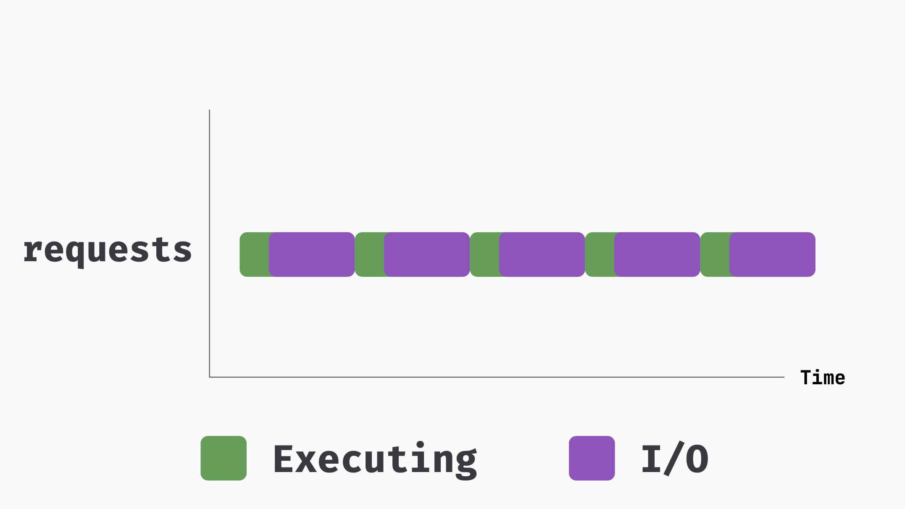
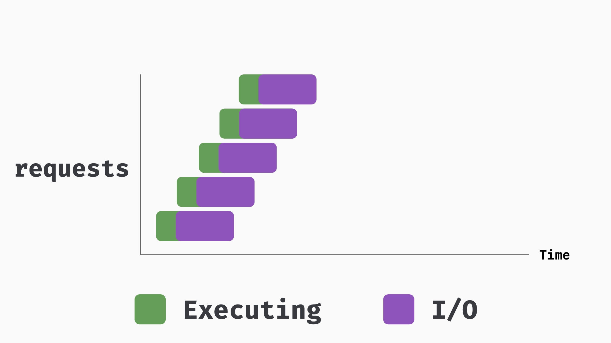
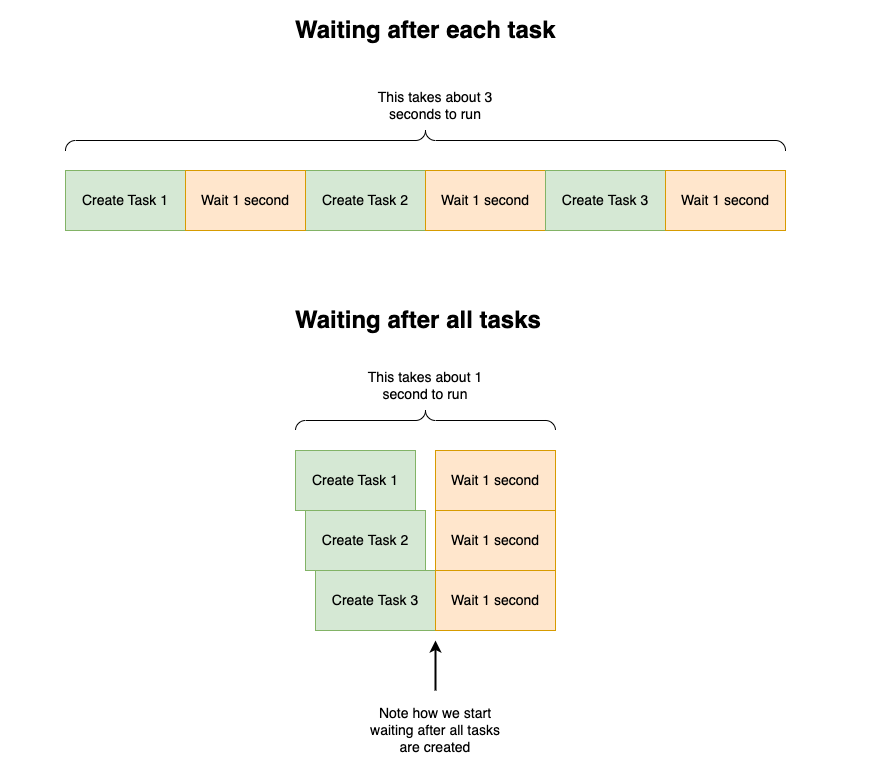
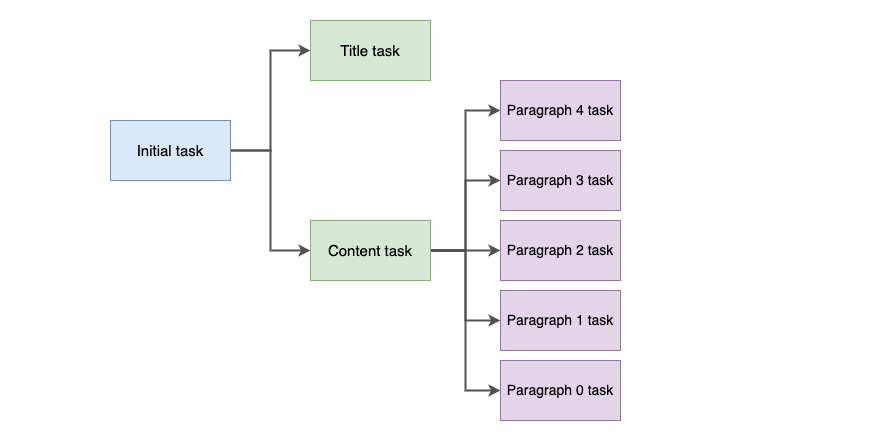

# Async & Sync Ruby
https://thoughtbot.com/blog/async-ruby-on-rails

## Being lazy with `_later`

1. **deliver_later**
```ruby
class User < ApplicationRecord
  def send_welcome_email_later
    RegistrationMailer.welcome_email(self).deliver_now
  end
end
```

2. **purge_later**

```ruby
class User < ApplicationRecord
  has_one_attached :avatar
end

User.first.avatar.purge_later # enqueue a job to delete the file
```

## Sync requests

```ruby
puts(
  Benchmark.realtime do
    5.times do
      Net::HTTP.get(URI.parse("https://httpbin.org/delay/2"))
    end
  end
)
```



## Async requests

```ruby
puts(
  Benchmark.realtime do
    Sync do
      5.times.map do
        Async do
          Net::HTTP.get(URI.parse("https://httpbin.org/delay/2"))
        end
      end.map(&:wait)
    end
  end
)
```




## Delete Dependent Associations Async with `destroy_async`

```ruby
class Team < ApplicationRecord
  has_many :players, dependent: :destroy_async
end

class Player < ApplicationRecord
  belongs_to :team
end

Team.destroy_by(name: "Flamengo")
# Enqueued ActiveRecord::DestroyAssociationAsyncJob
```

Note:
- You need to have `ActiveJob` configured to use this feature.
- Also, do not use this option if the association is backed by foreign key constraints in your database.

## Async database queries

```ruby
class ReportsController
  def create
    @new_authors = Author.recent.load_async
    @new_books = Book.recent.load_async
    @new_reviews = BookReview.recent.load_async
  end
end
```

The Rails logs will show that:

```bash
ASYNC Author Load  (1010.2ms) (db time 1011.4ms)
ASYNC Book Load       (2.2ms) (db time 1013.8ms)
ASYNC BookReview Load (0.2ms) (db time 1014.7ms)
```

The first number column shows us the time the query took to run in the foreground thread, while the second column shows the total time the query took on the database.

**Be careful with load_async!**
- As with any promises of performance improvements, there are trade-offs here. When using load_async, we’re using more resources (database connection threads) in a single request. This can be a problem if you’re using that on a part of the app that’s under heavy load, because one or a few users might exhaust the connections and other users will have to wait (and possibly timeout).
- A good use case for this, though, is when you have an HTTP request and a database query that can be done in parallel:

```ruby
class BooksController
  def show
    @new_books = Book.recent.load_async
    @external_books = HTTP.get("https://external.com/books")
  end
end
```

## Async views

Use Turbo Frames to load parts of the page in parallel.
Add a turbo frame to your view:

```html
<turbo-frame
  id="best_sellers"
  src="books/best_sellers"
  loading="lazy"
></turbo-frame>
```

Write a controller action that renders the frame content:

```ruby
class BooksController
  def best_sellers
    @books = Book.best_sellers
  end
end
```

And a view that renders the content:

```html
<turbo-frame id="best_sellers">
  <h1>Best Sellers</h1>
  <%= render @best_sellers %>
</turbo-frame>
```

## Async assets

Use `preload_link_tag` to preload assets in parallel:

```html
<script blocking="render" async src="async-script.js"></script>
```

## Adding indexes concurrently
When adding indexes to a Postgres table, it blocks the table for writes. This can lead to downtime in production if you have a big table. Luckily, we can use the concurrently option to create the index without blocking the table:

```ruby
class AddIndexToUserRoles < ActiveRecord::Migration
  disable_ddl_transaction!

  def change
    add_index :users, :role, algorithm: :concurrently
  end
end
```

**Note that we need to run this outside of a transaction, so we need to call disable_ddl_transaction! in the migration.**

## Async gem

- Github: https://socketry.github.io/async/
- Reference: https://thoughtbot.com/blog/my-adventure-with-async-ruby

### The problem

Refactor the `to_s` method to improve the time it takes to run from ~7 seconds to ~2 seconds.

```ruby
class Article
  def to_s
    <<~MARKDOWN
      # #{generate_title}

      #{generate_content}
    MARKDOWN
  end

  def generate_title
    sleep 2

    "A title"
  end

  def generate_content
    5.times.map { |i|
      generate_paragraph(i)
    }.join("\n")
  end

  private

  def generate_paragraph(i)
    sleep 1

    "Paragraph #{i}"
  end
end

t0 = Process.clock_gettime(Process::CLOCK_MONOTONIC)
Article.new.to_s
t1 = Process.clock_gettime(Process::CLOCK_MONOTONIC)
puts "Time: #{t1 - t0} seconds."
```

### Approaches



Concurrent tasks with `Async`:

- Reference: [My adventure with Async Ruby](https://thoughtbot.com/blog/my-adventure-with-async-ruby)
- Diagram of the execution:
  

- Solutions:
  - [async.rb](./async.rb)
